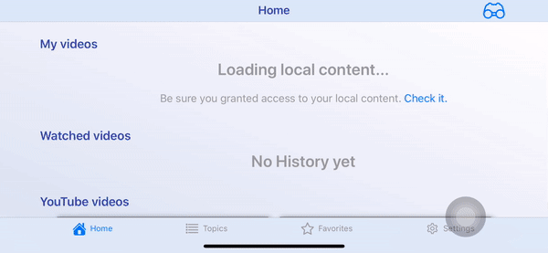

# Tutorializer

Tutorial framework helps to describe behavior of UI based on real view. Definitely, UX should be clear and intuitive, but sometimes it is not easy to do, 
espesially, when you implement uncommon behaviour, therefore you have to bring idea for user how to use it. The framework will help to create simple, 
responsive to device orientation tutorial flow based on real view.

## Screenshots

- **Portrait**

- **Landscape**

## How to use

## License

This project is licensed under the terms of the [MIT license](https://github.com/MaximKomlev/Tutorializer/blob/master/LICENSE).
